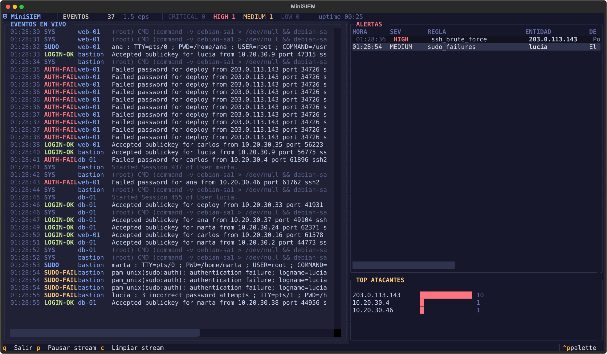

# MiniSIEM

Un SIEM ligero escrito en Python que monitoriza logs de Linux en tiempo real,
detecta patrones de ataque y lo muestra todo en un **dashboard SOC dentro de la
terminal** (construido con [Textual](https://textual.textualize.io/)).



## Qué hace

- **Ingesta**: sigue `auth.log` / `syslog` en vivo (estilo `tail -f`, con soporte
  de rotación de logs), o genera tráfico simulado con el modo demo.
- **Normalización**: parsea las líneas crudas (sshd, sudo, useradd...) a eventos
  estructurados con timestamp, host, usuario e IP de origen.
- **Detección**: correlaciona eventos con ventanas de tiempo deslizantes y
  dispara alertas por severidad (LOW → CRITICAL), con deduplicación para no
  inundar el panel.
- **Persistencia**: todos los eventos y alertas quedan guardados en SQLite.
- **Visualización**: dashboard en terminal con stream de eventos en vivo, tabla
  de alertas coloreada por severidad, ranking de IPs atacantes y contadores
  (EPS, totales, alertas por nivel).

## Arquitectura

```
Collectors (hilos) ──> Queue ──> Parser ──> Event ──┬──> SQLite
 · tail de ficheros                                 │
 · simulador                                        └──> Motor de detección ──> Alert ──> SQLite
                                                                                  │
                                                    TUI Textual  <── mensajes ───┘
```

Cada pieza vive en su propio módulo (`collectors/`, `parsers/`, `detection/`,
`storage.py`, `tui/`) y el `pipeline.py` las conecta. La TUI no sabe nada de
logs: solo recibe eventos y alertas ya procesados.

## Reglas de detección incluidas

| Regla | Condición | Severidad |
|---|---|---|
| `ssh_brute_force` | ≥5 contraseñas fallidas de la misma IP en 60s | HIGH |
| `ssh_success_after_failures` | Login exitoso desde una IP con ≥3 fallos recientes | CRITICAL |
| `root_ssh_login` | Cualquier login SSH aceptado como root | HIGH |
| `invalid_user_spray` | ≥5 usuarios inexistentes desde la misma IP en 120s | MEDIUM |
| `sudo_failures` | ≥3 fallos de autenticación sudo del mismo usuario en 5 min | MEDIUM |
| `new_user_created` | Creación de una cuenta local (persistencia) | MEDIUM |

Las reglas comparten una ventana deslizante genérica (`detection/base.py`), así
que añadir una nueva es implementar una clase con un método `check()`.

## Instalación y uso

```bash
pip install -r requirements.txt

# Modo demo: genera ruido normal + escenarios de ataque simulados.
# Funciona en cualquier máquina, sin permisos ni logs reales.
python -m minisiem --demo

# Modo real: sigue /var/log/auth.log y /var/log/syslog
# (normalmente requiere sudo para poder leerlos)
sudo python -m minisiem

# Seguir un fichero concreto, leyéndolo desde el principio (replay)
python -m minisiem --log-file /ruta/al/auth.log --from-start
```

Atajos dentro del dashboard: `q` salir · `p` pausar el stream · `c` limpiar el stream.

Los eventos y alertas se guardan en `./minisiem.db` (configurable con `--db`).
Puedes explorar el histórico con sqlite3:

```bash
sqlite3 minisiem.db "SELECT datetime(ts,'unixepoch'), rule, entity, message FROM alerts ORDER BY ts DESC LIMIT 10"
```

## Tests

```bash
python -m pytest
```

Cubren los parsers (líneas reales de auth.log), cada regla de detección
(dispara en el umbral, no dispara fuera de ventana) y el almacenamiento.

## Nota

El simulador solo usa rangos de IP reservados para documentación (RFC 5737:
`203.0.113.0/24`, `198.51.100.0/24`, `192.0.2.0/24`), así que ningún dato de la
demo apunta a direcciones reales.
